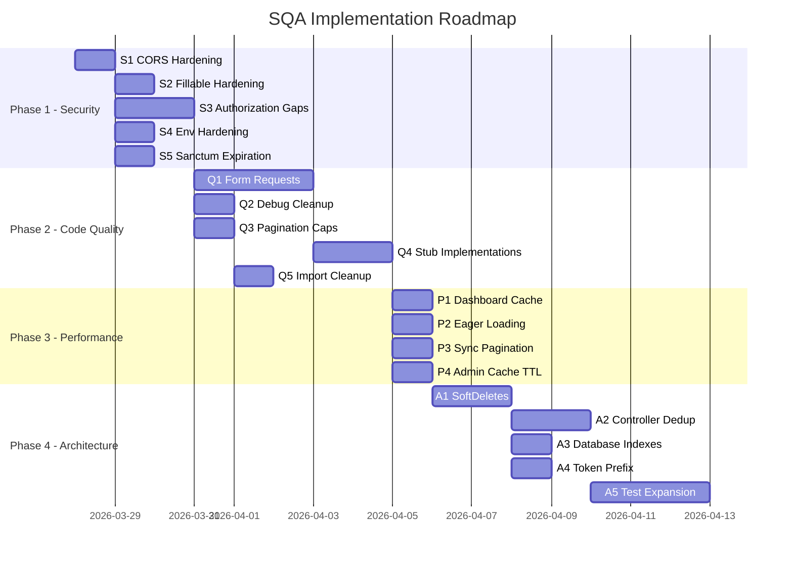

# Backend SQA Implementation Plan — bangers-backend

> **Generated from:** [SQA Report](file:///home/voss/.gemini/antigravity/brain/9e88d933-4b19-4942-a6e0-0a339632a675/sqa_report.md)
> **Date:** 2026-03-28 | **Status:** Ready for review

---

## Corrections from Initial SQA Report

During deeper inspection, the following items from the SQA report are **already implemented**:

| SQA Finding | Actual Status |
|-------------|--------------|
| No rate limiting on auth | ✅ Already implemented — `throttle:5,1` on both [api/AuthRoutes.php](file:///home/voss/Projects/Bangers/bangers-backend/routes/api/AuthRoutes.php) and [mobile/AuthRoutes.php](file:///home/voss/Projects/Bangers/bangers-backend/routes/mobile/AuthRoutes.php) |
| Friendship status endpoint missing | ✅ Already exists — `FriendshipController::status()` with dedicated route |
| Feature flags system needed | ✅ Already exists — [config/features.php](file:///home/voss/Projects/Bangers/bangers-backend/config/features.php) + `ConfigController` |
| `.env` committed to git | ✅ `.env` is in [.gitignore](file:///home/voss/Projects/Bangers/bangers-backend/.gitignore) |

---

## Phase 1: Security Hardening 🔴

### S1 — Restrict CORS Origins
**Severity: 🔴 Critical | Effort: Low**

Currently `allowed_origins => ['*']` allows any website to make authenticated API calls.

#### [MODIFY] [cors.php](file:///home/voss/Projects/Bangers/bangers-backend/config/cors.php)
```diff
- 'allowed_origins' => ['*'],
+ 'allowed_origins' => explode(',', env('CORS_ALLOWED_ORIGINS', 'http://localhost:3000,http://localhost:5173')),

- 'allowed_methods' => ['*'],
+ 'allowed_methods' => ['GET', 'POST', 'PUT', 'PATCH', 'DELETE', 'OPTIONS'],

- 'allowed_headers' => ['*'],
+ 'allowed_headers' => ['Content-Type', 'Authorization', 'Accept', 'X-Requested-With'],

- 'max_age' => 0,
+ 'max_age' => 86400,
```

Add to `.env.example`:
```
CORS_ALLOWED_ORIGINS=http://localhost:3000,http://localhost:5173
```

---

### S2 — Harden `$fillable` on User Model
**Severity: 🔴 Critical | Effort: Low**

`is_verified` and `password` are in `$fillable`, which allows mass assignment of security-sensitive fields.

#### [MODIFY] [User.php](file:///home/voss/Projects/Bangers/bangers-backend/app/Models/User.php)
```diff
  protected $fillable = [
      'first_name',
      'last_name',
      'email',
      'username',
      'password',
      'dob',
      'bio',
      'profile_media_id',
-     'is_verified',
      'is_public',
      'version',
  ];
```

> [!IMPORTANT]
> `is_verified` should only be set through a dedicated admin method or email verification flow, never via mass assignment. `password` is acceptable in `$fillable` because it's hashed via the `hashed` cast, but should be validated carefully at every entry point.

Add a dedicated method for admin verification:
```php
public function markAsVerified(): void
{
    $this->is_verified = true;
    $this->save();
}
```

---

### S3 — Add Authorization to Unprotected Controllers
**Severity: 🔴 High | Effort: Medium**

Several admin-scoped controllers lack explicit authorization checks. While they're behind `auth:sanctum` + `role:admin` middleware at the route level, defense-in-depth requires controller-level authorization.

#### [MODIFY] [StageController.php](file:///home/voss/Projects/Bangers/bangers-backend/app/Http/Controllers/Api/StageController.php)
Add `Gate::authorize()` to mutating methods:
```php
public function store(Request $request)
{
    Gate::authorize('manage_content');
    // ... existing code
}

public function update(Request $request, Stage $stage)
{
    Gate::authorize('manage_content');
    // ... existing code
}

public function destroy(Stage $stage)
{
    Gate::authorize('manage_content');
    // ... existing code
}
```

#### [MODIFY] [MediaController.php](file:///home/voss/Projects/Bangers/bangers-backend/app/Http/Controllers/Api/MediaController.php)
Add ownership validation on delete:
```php
public function destroy(Media $media)
{
    Gate::authorize('manage_content');
    Storage::disk("public")->delete($media->storage_key);
    $media->delete();
    return response()->json(null, 204);
}
```

#### [MODIFY] [ArtistController.php](file:///home/voss/Projects/Bangers/bangers-backend/app/Http/Controllers/Api/ArtistController.php)
Add `Gate::authorize('manage_content')` to `store`, `update`, `destroy`.

---

### S4 — Harden Production `.env` Configuration
**Severity: 🔴 High | Effort: Low**

The `.env` has development values that must never reach production.

#### [MODIFY] [.env.example](file:///home/voss/Projects/Bangers/bangers-backend/.env.example)
Document production requirements in comments:
```diff
- APP_DEBUG=true
+ APP_DEBUG=false  # MUST be false in production

- DB_USERNAME=root
- DB_PASSWORD=secret
+ DB_USERNAME=bangers_app  # Use a non-root user in production
+ DB_PASSWORD=              # Use a strong, unique password

+ # CORS — Restrict in production
+ CORS_ALLOWED_ORIGINS=https://admin.bangers.app

+ # Sanctum token prefix for secret scanning
+ SANCTUM_TOKEN_PREFIX=bangers_
```

---

### S5 — Set Sanctum Global Token Expiration
**Severity: 🟠 Medium | Effort: Low**

`sanctum.expiration` is `null`, meaning any token without an explicit `expires_at` lives forever.

#### [MODIFY] [sanctum.php](file:///home/voss/Projects/Bangers/bangers-backend/config/sanctum.php)
```diff
- 'expiration' => null,
+ 'expiration' => (int) env('SANCTUM_EXPIRATION', 1440), // 24h safety net
```

---

## Phase 2: Code Quality 🟡

### Q1 — Migrate Inline Validation to Form Requests
**Severity: 🟡 Medium | Effort: Medium**

Create dedicated Form Request classes for all controllers still using inline validation.

#### [NEW] `app/Http/Requests/Admin/StoreStageRequest.php`
```php
<?php
namespace App\Http\Requests\Admin;

use Illuminate\Foundation\Http\FormRequest;

class StoreStageRequest extends FormRequest
{
    public function authorize(): bool { return true; }

    public function rules(): array
    {
        return [
            'event_id' => 'required|uuid|exists:events,id',
            'name'     => 'required|string|max:255',
            'description' => 'nullable|string',
            'stage_id' => 'nullable|uuid|exists:stages,id',
        ];
    }
}
```

#### [NEW] `app/Http/Requests/Admin/UpdateStageRequest.php`
```php
<?php
namespace App\Http\Requests\Admin;

use Illuminate\Foundation\Http\FormRequest;

class UpdateStageRequest extends FormRequest
{
    public function authorize(): bool { return true; }

    public function rules(): array
    {
        return [
            'name'        => 'sometimes|required|string|max:255',
            'description' => 'nullable|string',
        ];
    }
}
```

#### [NEW] `app/Http/Requests/Admin/StoreMediaRequest.php`
```php
<?php
namespace App\Http\Requests\Admin;

use Illuminate\Foundation\Http\FormRequest;

class StoreMediaRequest extends FormRequest
{
    public function authorize(): bool { return true; }

    public function rules(): array
    {
        return [
            'file'      => 'required|file|image|max:5120',
            'type'      => 'required|string|in:profile_picture,artist_image,event_banner',
            'is_public' => 'boolean',
        ];
    }
}
```

#### [NEW] `app/Http/Requests/SearchRequest.php`
Validates search input that currently passes `$request->all()` raw:
```php
<?php
namespace App\Http\Requests;

use Illuminate\Foundation\Http\FormRequest;

class SearchRequest extends FormRequest
{
    public function authorize(): bool { return true; }

    public function rules(): array
    {
        return [
            'query'    => 'nullable|string|max:100',
            'date'     => 'nullable|date',
            'location' => 'nullable|string|max:100',
            'entities' => 'nullable',
            'per_page' => 'nullable|integer|min:1|max:50',
        ];
    }
}
```

#### [NEW] `app/Http/Requests/Admin/StoreRoleRequest.php`
#### [NEW] `app/Http/Requests/Admin/UpdateRoleRequest.php`
#### [NEW] `app/Http/Requests/Admin/UpdateUserRequest.php`
#### [NEW] `app/Http/Requests/Admin/AttachArtistRequest.php`

> Apply the same pattern for `ActController` attach/detach methods, `RolesController`, and `UserController::update`.

Then update each controller to inject the new Form Request instead of inline validation.

---

### Q2 — Remove Debug Code & Stale Comments
**Severity: 🟡 Medium | Effort: Low**

#### [MODIFY] [TimetableService.php](file:///home/voss/Projects/Bangers/bangers-backend/app/Services/TimetableService.php)
```diff
-         // dd('Passed checks', $entries->count());
```

#### [MODIFY] [MediaController.php](file:///home/voss/Projects/Bangers/bangers-backend/app/Http/Controllers/Api/MediaController.php)
Remove commented-out code blocks (lines 40-42, 54-55).

#### [MODIFY] [AuthController.php](file:///home/voss/Projects/Bangers/bangers-backend/app/Http/Controllers/Api/AuthController.php) (both Api and Mobile)
Remove orphaned doc comment at end of class:
```diff
-     /**
-      * Helper to generate standardized response is now handled by AuthService.
-      */
```

---

### Q3 — Cap Pagination on All Endpoints
**Severity: 🟡 Medium | Effort: Low**

#### [MODIFY] [StageController.php](file:///home/voss/Projects/Bangers/bangers-backend/app/Http/Controllers/Api/StageController.php)
```diff
- $perPage = $request->query('per_page', 15);
+ $perPage = min(max((int) $request->query('per_page', 15), 1), 100);

- if ($perPage == -1) {
-     return StageResource::collection($query->with('events')->get());
- }
```

> [!WARNING]
> Removing the `-1` (unbounded) option is a **breaking change** for any admin frontend relying on it. If needed, replace with a paginated "all" option capped at 500.

#### [MODIFY] [UserController.php](file:///home/voss/Projects/Bangers/bangers-backend/app/Http/Controllers/Api/UserController.php)
```diff
- $perPage = $request->query('size', 20);
+ $perPage = min(max((int) $request->query('size', 20), 1), 100);
```

---

### Q4 — Fix Unfinished Stub Implementations
**Severity: 🟡 Medium | Effort: Medium**

#### [MODIFY] [SearchService.php](file:///home/voss/Projects/Bangers/bangers-backend/app/Services/SearchService.php)
Implement actual friend-based event filtering in `getFriendsEvents()`:
```php
public function getFriendsEvents(User $user, int $perPage = 10): LengthAwarePaginator
{
    $friendIds = Friendship::where('status', 'accepted')
        ->where(fn($q) => $q->where('user_id_1', $user->id)->orWhere('user_id_2', $user->id))
        ->get()
        ->map(fn($f) => $f->user_id_1 === $user->id ? $f->user_id_2 : $f->user_id_1);

    return Event::with(['banner'])
        ->withUserStatus()
        ->whereHas('attendees', fn($q) => $q->whereIn('user_id', $friendIds))
        ->where('start_date', '>=', now())
        ->orderBy('start_date', 'asc')
        ->paginate($perPage);
}
```

Apply the same query pattern to the `friendsEvents` block in [Mobile/DashboardController.php](file:///home/voss/Projects/Bangers/bangers-backend/app/Http/Controllers/Mobile/DashboardController.php).

#### [MODIFY] [UserController.php](file:///home/voss/Projects/Bangers/bangers-backend/app/Http/Controllers/Api/UserController.php)
Implement the privacy check from the TODO comment:
```php
public function show($id)
{
    $user = User::with('roles')->findOrFail($id);

    if (!$user->is_public && auth()->id() !== $user->id && !auth()->user()?->hasRole('admin')) {
        return new UserResource($user->only(['id', 'username', 'first_name', 'is_public']));
    }

    return new UserResource($user->load(['roles.permissions', 'profileMedia']));
}
```

---

### Q5 — Inline Gate Imports in GroupController
**Severity: 🟢 Low | Effort: Low**

#### [MODIFY] [GroupController.php](file:///home/voss/Projects/Bangers/bangers-backend/app/Http/Controllers/Mobile/GroupController.php)
Replace inline `\Illuminate\Support\Facades\Gate::authorize()` with a proper `use` import:
```diff
+ use Illuminate\Support\Facades\Gate;

- \Illuminate\Support\Facades\Gate::authorize('view', $group);
+ Gate::authorize('view', $group);
```
Apply to all 6 occurrences in the file and similarly in [GroupTimetableController.php](file:///home/voss/Projects/Bangers/bangers-backend/app/Http/Controllers/Mobile/GroupTimetableController.php).

---

## Phase 3: Performance 🟠

### P1 — Dashboard Thundering Herd Protection
**Severity: 🟠 Medium | Effort: Medium**

#### [MODIFY] [Mobile/DashboardController.php](file:///home/voss/Projects/Bangers/bangers-backend/app/Http/Controllers/Mobile/DashboardController.php)
Add cache locking to prevent stampede when cache expires under load:
```php
$dashboardData = Cache::flexible("user_{$user->id}_dashboard", [300, 600], function () use ($user, $eventRelations) {
    // ... existing closure body
});
```

Alternatively, if `Cache::flexible` isn't available in your cache driver, use a lock:
```php
$dashboardData = Cache::remember("user_{$user->id}_dashboard", 600, function () use ($user, $eventRelations) {
    // ... existing closure body
});
// The key insight: ClearDashboardCache listener already busts this cache on data changes,
// so the 600s TTL is a safety net, not the primary invalidation mechanism.
```

> Consider splitting into smaller cache keys (user_profile, upcoming_events, etc.) so partial invalidation doesn't require rebuilding everything.

---

### P2 — Eager Load Missing Relations in Friendship Queries
**Severity: 🟠 Medium | Effort: Low**

#### [MODIFY] [FriendshipService.php](file:///home/voss/Projects/Bangers/bangers-backend/app/Services/FriendshipService.php)
```diff
  public function getFriends(string $userId): Collection
  {
-     return Friendship::with(['user1', 'user2'])
+     return Friendship::with(['user1.profileMedia', 'user2.profileMedia'])
          ->where('status', 'accepted')
```

---

### P3 — Sync Endpoint Pagination
**Severity: 🟠 Medium | Effort: Medium**

The 500-record hard limit in `SyncController` may silently miss updates if more than 500 records change between syncs.

#### [MODIFY] [SyncController.php](file:///home/voss/Projects/Bangers/bangers-backend/app/Http/Controllers/Mobile/SyncController.php)
Add a `has_more` indicator so the client knows to paginate:
```php
$limit = 500;
$results = $query->limit($limit + 1)->get();
$hasMore = $results->count() > $limit;

return EventResource::collection($results->take($limit))
    ->additional([
        'sync_timestamp' => now()->toIso8601String(),
        'has_more' => $hasMore,
    ]);
```

---

### P4 — Admin Dashboard Denormalized Counts
**Severity: 🟢 Low | Effort: Low**

#### [MODIFY] [Api/DashboardController.php](file:///home/voss/Projects/Bangers/bangers-backend/app/Http/Controllers/Api/DashboardController.php)
The admin dashboard already caches for 300s. Consider increasing TTL or using `Cache::flexible()` since admin stats don't need real-time accuracy:
```diff
- $stats = Cache::remember('admin_dashboard_stats', 300, function () {
+ $stats = Cache::remember('admin_dashboard_stats', 900, function () { // 15 min for admin stats
```

---

## Phase 4: Architecture & Maintainability 🔵

### A1 — Add SoftDeletes to Critical Models
**Severity: 🟡 Medium | Effort: Medium**

#### [MODIFY] [User.php](file:///home/voss/Projects/Bangers/bangers-backend/app/Models/User.php)
```diff
+ use Illuminate\Database\Eloquent\SoftDeletes;

  class User extends Authenticatable
  {
-     use HasFactory, Notifiable, HasUuids, HasApiTokens;
+     use HasFactory, Notifiable, HasUuids, HasApiTokens, SoftDeletes;
```

#### [NEW] Migration: `add_soft_deletes_to_users_table`
```php
Schema::table('users', function (Blueprint $table) {
    $table->softDeletes();
});
```

Repeat for `Artist`, `Act`, and `Group` models. Also create corresponding migration files.

> [!IMPORTANT]
> After adding SoftDeletes, review all queries that need to include soft-deleted records (e.g., sync endpoints already use `withTrashed()`). Review `User::findOrFail()` calls to ensure they don't break when a user is soft-deleted.

---

### A2 — Deduplicate API & Mobile Auth Controllers
**Severity: 🟢 Low | Effort: Medium**

Both [Api/AuthController](file:///home/voss/Projects/Bangers/bangers-backend/app/Http/Controllers/Api/AuthController.php) and [Mobile/AuthController](file:///home/voss/Projects/Bangers/bangers-backend/app/Http/Controllers/Mobile/AuthController.php) share ~90% of code. Extract shared logic into a trait.

#### [NEW] `app/Http/Controllers/Traits/AuthenticatesUsers.php`
```php
<?php
namespace App\Http\Controllers\Traits;

use App\Http\Requests\Auth\RegisterRequest;
use App\Http\Requests\Auth\LoginRequest;
use Illuminate\Http\Request;

trait AuthenticatesUsers
{
    public function register(RegisterRequest $request)
    {
        $user = $this->authService->register($request->validated());
        return response()->json(
            $this->authService->generateTokenResponse($user, $this->getLoadRelations()),
            201
        );
    }

    public function login(LoginRequest $request)
    {
        $user = $this->authService->login($request->email, $request->password);
        return response()->json(
            $this->authService->generateTokenResponse($user, $this->getLoadRelations())
        );
    }

    public function logout(Request $request)
    {
        $request->user()->currentAccessToken()->delete();
        return response()->json(['message' => 'Logged out successfully']);
    }

    public function refresh(Request $request)
    {
        $user = $request->user();
        if (!$user->tokenCan('refresh')) {
            abort(403, 'Invalid token for refresh');
        }
        $this->authService->refresh($user);
        return response()->json(
            $this->authService->generateTokenResponse($user, $this->getLoadRelations())
        );
    }

    abstract protected function getLoadRelations(): array;
}
```

Then each controller just defines `getLoadRelations()`:
- **Api:** `['roles.permissions']`
- **Mobile:** `['roles.permissions', 'profileMedia']`

Apply the same trait pattern to the duplicate `FriendshipController` pair.

---

### A3 — Review Database Indexes
**Severity: 🟢 Low | Effort: Low**

#### [NEW] Migration: `add_performance_indexes`
```php
// Friendship lookup by ordered pair + status
Schema::table('friendships', function (Blueprint $table) {
    $table->index(['user_id_1', 'user_id_2', 'status']);
    $table->index(['requested_by']);
});

// User search by public flag
Schema::table('users', function (Blueprint $table) {
    $table->index(['is_public']);
});

// Attendance lookup
Schema::table('user_event_attendance', function (Blueprint $table) {
    $table->index(['user_id', 'status']);
    $table->index(['event_id', 'status']);
});

// Timetable entry ordering
Schema::table('timetable_entries', function (Blueprint $table) {
    $table->index(['start_time']);
});
```

> Run `EXPLAIN ANALYZE` on the heaviest queries (dashboard, search, friendship lookups) to confirm which indexes are needed before creating them.

---

### A4 — Set Sanctum Token Prefix
**Severity: 🟢 Low | Effort: Low**

#### [MODIFY] [.env.example](file:///home/voss/Projects/Bangers/bangers-backend/.env.example)
```diff
+ SANCTUM_TOKEN_PREFIX=bangers_
```

This enables automatic secret scanning by GitHub/GitLab to flag accidentally committed tokens.

---

### A5 — Expand Test Coverage
**Severity: 🟢 Low | Effort: High**

#### [NEW] Tests to add:

| Test File | Coverage |
|-----------|----------|
| `tests/Feature/Auth/RateLimitTest.php` | Verify rate limiting works on register (currently only login is tested) |
| `tests/Feature/Authorization/StageAuthTest.php` | Verify unauthorized users can't create/update/delete stages |
| `tests/Feature/Authorization/MediaAuthTest.php` | Verify media upload/delete authorization |
| `tests/Feature/SearchValidationTest.php` | Test query length limits, malformed entities param |
| `tests/Feature/PaginationTest.php` | Test per_page cap enforcement across endpoints |
| `tests/Feature/UserPrivacyTest.php` | Test private profile endpoint returns limited data |
| `tests/Feature/SoftDeleteTest.php` | Test soft-deleted records are excluded from normal queries but included in sync |

---

## Verification Plan

### Automated Tests
```bash
# Run the full test suite after each phase
php artisan test

# Run with coverage to track improvement
php artisan test --coverage
```

### Manual Verification
1. **CORS (S1):** Use `curl` with `Origin: https://evil.com` header — should get CORS rejection
2. **Mass assignment (S2):** Attempt `PUT /users/{id}` with `is_verified: true` — should be ignored
3. **Pagination (Q3):** Request `?per_page=99999` — should cap at 100
4. **Privacy (Q4):** View a private user's profile as non-friend — should get limited data
5. **Dashboard (P1):** Flush cache, hit dashboard concurrently — verify no stampede

---

## Implementation Order



**Estimated total effort:** ~3-4 sprints (~15-20 working days)
